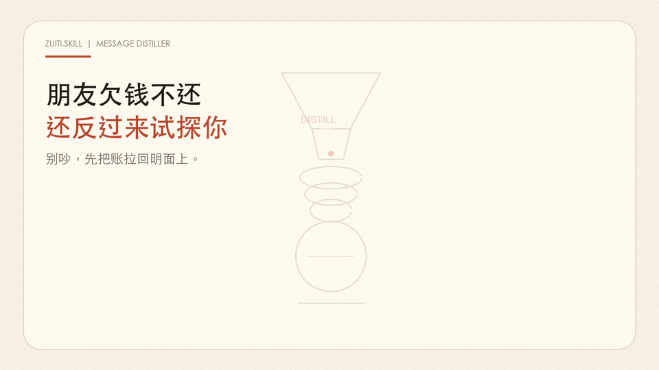
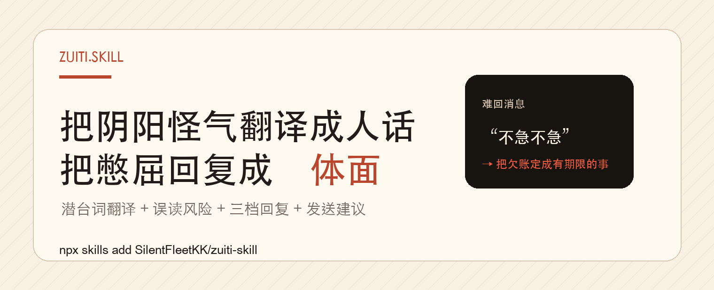
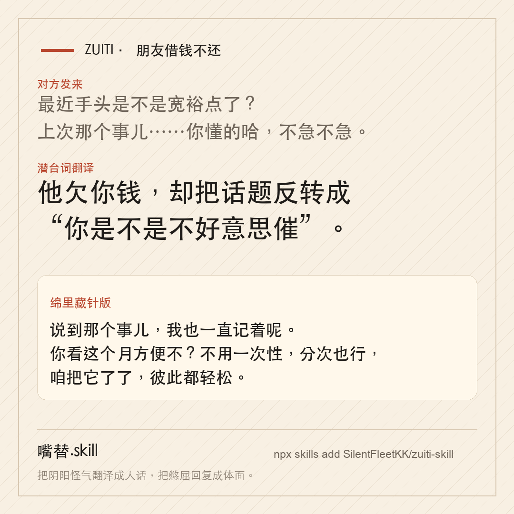
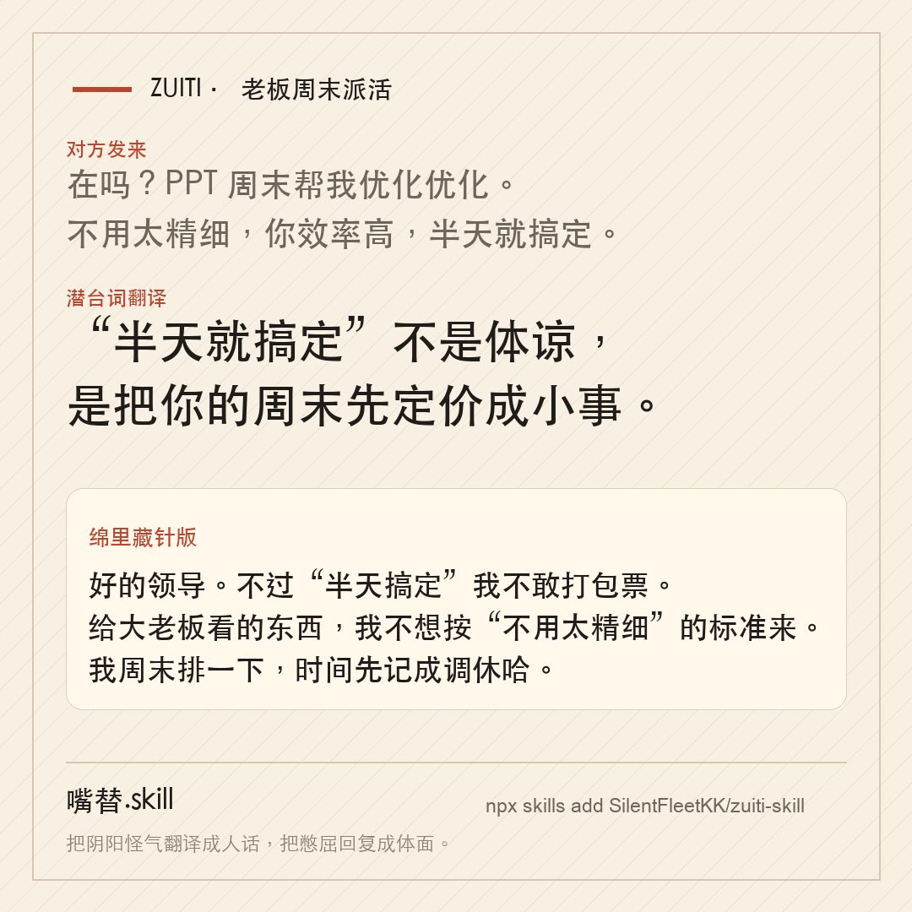
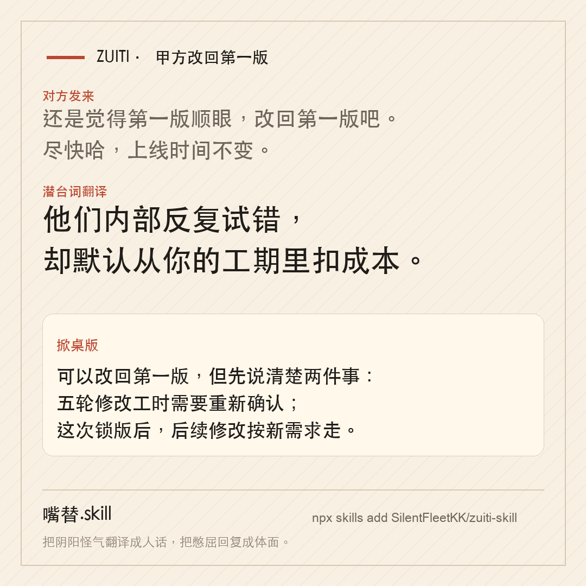
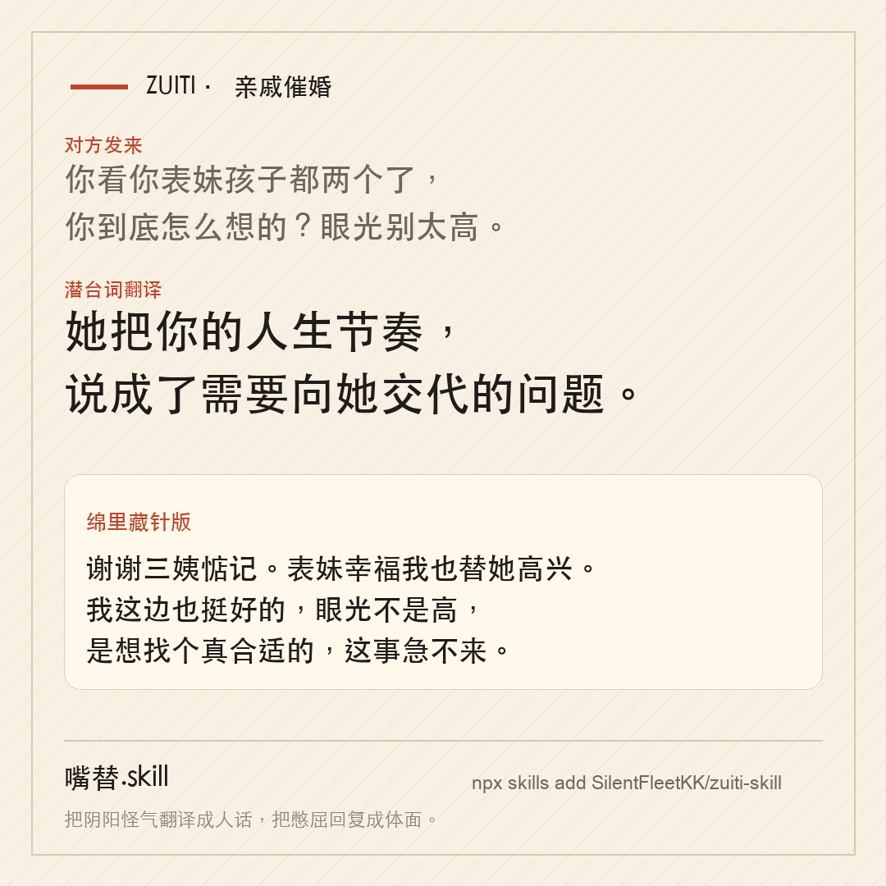
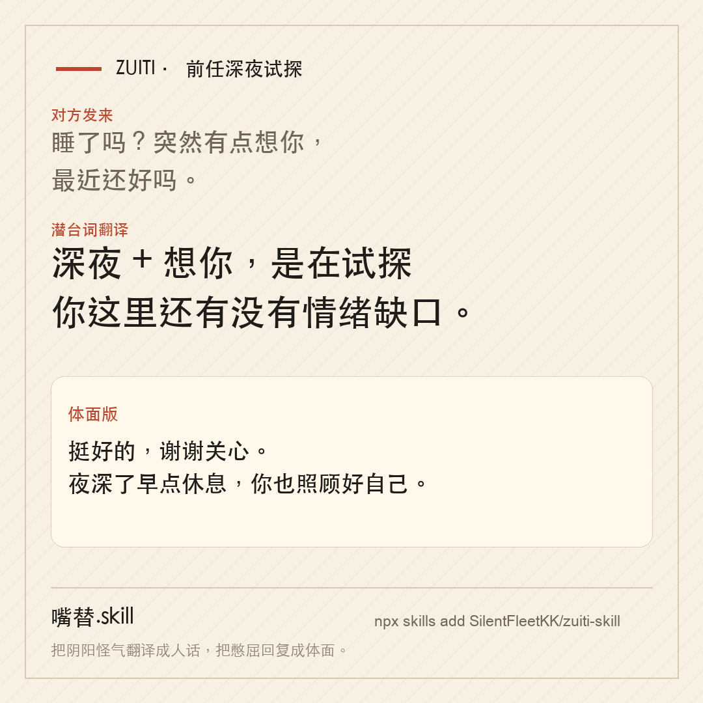
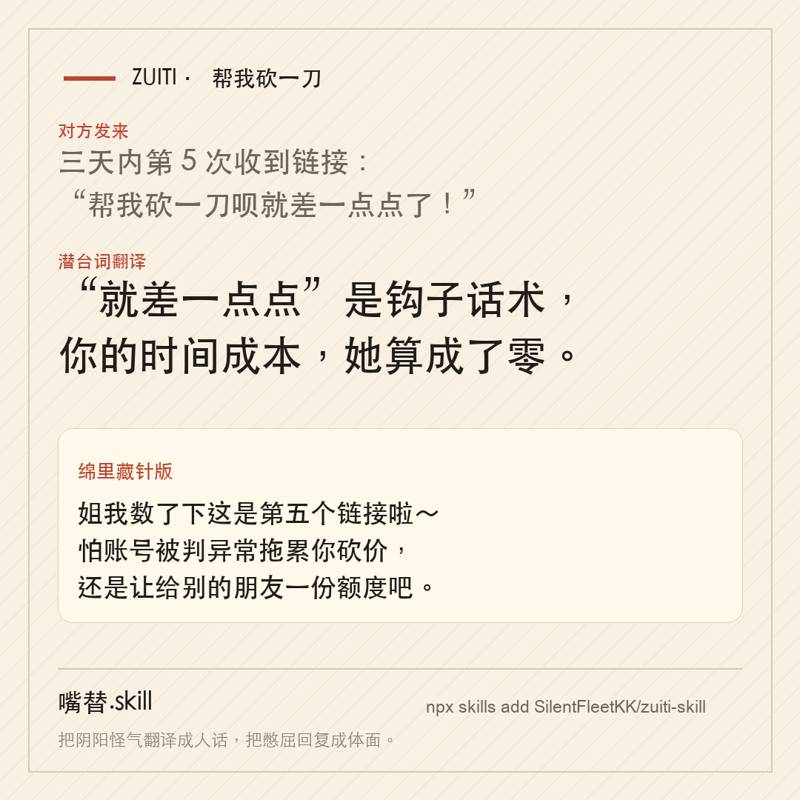

# 嘴替.skill

<div align="center">



<sub>宣传短片由 [`tools/generate_promo_assets.py`](tools/generate_promo_assets.py) 生成；备用视频见 [`assets/hero.mp4`](assets/hero.mp4)。</sub>

**把阴阳怪气翻译成人话，把憋屈回复成体面。**

[](LICENSE)
[](https://agentskills.io)
[](#安装)
[](https://github.com/SilentFleetKK/zuiti-skill/discussions)

老板画饼、甲方压价、亲戚催婚、伴侣阴阳怪气、前任深夜试探、同事当众甩锅、亲戚朋友"帮我砍一刀"死缠烂打。  
所有"这条我到底该怎么回"的时刻，你都有一个发得出去、站得住、睡得着的嘴替。

[看效果](#看效果) · [安装](#安装) · [怎么用](#怎么用) · [场景包](#场景包) · [专属嘴替](#专属嘴替) · [安全边界](#安全边界) · [路线图](#路线图)

**English:** [README_EN.md](README_EN.md)

</div>

---

<p align="center">
  
</p>

## 看效果

> 每一档都是能直接复制发送的成品，不是"你可以这样说"。三档是**姿态的阶梯**，不是同一句话的三种客气程度——盖住标签也要能一眼认出是哪档。

### 朋友借钱不还

> **朋友**（借钱三个月没还）  
> 最近手头是不是宽裕点了？上次那个事儿……你懂的哈，不急不急。

🎭 **潜台词翻译**  
他欠你钱，却用"你是不是宽裕了"把话题反转——试探你会不会主动提，或者暗示你"有钱就别催"。"不急不急"是话术：真不急的人，不会专门发这条。  
⚖️ **误读风险：低**——线索明确（三个月 + 钱 + 主动提旧账又不说清）。

💬 **三档回复**

【体面版】  
哈哈还那样～对了正好说到，上次那笔你看方便的时候安排一下就行，不着急，给我留个心就好。

【绵里藏针版】  
我这边紧紧巴巴的哈～说到"那个事儿"，我也一直记着呢，你看这个月方便不？不用一次性，分次也行，咱把它了了，彼此都轻松。

【掀桌版】  
宽裕谈不上哈。既然你提到上次那事，咱就说清楚：那笔钱到现在三个月了，你看什么时候能还？定个时间我心里也有数。不是催你，是账还是得算明白，咱这朋友才处得长久。

🧭 **长期策略**  
模糊的欠账最伤朋友。每次都平静地把"定个时间"摆出来——不吵、不翻旧账，把它变成有期限的事，反而是保护这段关系。

📌 **发送建议**  
优先发【绵里藏针版】：把钱拉回明面，又给了对方还款方式和台阶。

---

### 老板周末派活

> **老板**（周五 18:47）  
> 在吗？下周一早上我约了大老板过方案，PPT 周末你帮我优化优化。不用做太精细，你效率高，半天就搞定了。

🎭 **潜台词翻译**  
"不用太精细""半天就搞定"不是体谅你，是提前把这活定性成小事，让你既不好意思拒绝，也不好意思提补偿。  
⚖️ **误读风险：低**——时间点、截止期和"半天"一起出现，已构成明确的周末占用。

💬 **三档回复**

【体面版】  
在的。方案我周末来弄，为了一次改到位，您把要重点过的几页、还有大老板最关注的点发我一下？我集中把这几块打磨好，周一早上您直接用。

【绵里藏针版】  
好的领导。不过"半天搞定"我不敢打包票——给大老板看的东西，我不想按"不用太精细"的标准来。我周末排一下，周日晚上给您终版；这周末的时间我先记成调休哈，下周找天补上。

【掀桌版】  
领导，这个方案重要我知道，所以两件事咱们说开：一，给大老板过的东西，"半天、不用精细"是做不出来的，真按这个标准出了问题算谁的？二，周末加班我可以配合，但走加班申报还是调休，您定一个。定了我马上开工。

🧭 **长期策略**  
活越被说得轻，越不用给你补偿。以后凡是"很简单/顺手/半天"的活，都自然地报一个真实工作量再接。

📌 **发送建议**  
优先发【绵里藏针版】：接住活，又顺手把"调休"和真实工作量放上桌。

---

### 甲方改回第一版

> **甲方**（第五轮修改后）  
> 我们领导看了，还是觉得第一版顺眼，改回第一版吧。尽快哈，上线时间不变。

🎭 **潜台词翻译**  
折腾五版又回到起点，说明他们内部没人能拍板，试错成本全让你垫。"上线时间不变"最扎心：他们决策反复浪费的时间，默认从你的工期里扣。  
⚖️ **误读风险：低**——五轮改动全程按对方意见走、又明说"上线时间不变"，成本转嫁意图清楚。

💬 **掀桌版**（连续被消耗时的一档；体面 / 绵里藏针见 [`examples/对外沟通.md`](examples/对外沟通.md)）  
可以改回第一版，但两件事得说在前面：一，前后五轮修改都是按你们的意见走的，工时是实际发生的成本，我整理明细过来，咱们得聊聊怎么算；二，"上线时间不变"的前提是这次锁版——领导书面确认第一版之后不再改。两个都定了，我今天就动工。

📌 **发送建议**  
合同没写修改轮次，先用绵里藏针版争取书面确认；已被连续消耗，就发掀桌版把规则立住。

---

### 妈妈催婚

> **妈妈**  
> 王阿姨给你介绍了个男孩子，条件真的很好，见一面怎么了？妈不图你什么，就这一个心事。你别嫌我们烦，我跟你爸年纪都上来了。

🎭 **潜台词翻译**  
这条没有套路，焦虑是真的，爱也是真的。她要的不是你立刻结婚，是"这事有人在管"的确定感。别当成攻击去防御，她越被顶回去越焦虑。  
⚖️ **误读风险：高**——这更像真实焦虑而非话术，别按套路去防御。这一档是"诚实高于抓马"的样板。

💬 **绵里藏针版**（亲密关系里少用"赢"的姿态；另两档见 [`examples/亲密关系.md`](examples/亲密关系.md)）  
妈，人我可以见。但有件事想跟你说清楚：我不是不上心，是想找对的，不想凑合——这是对我负责，也是对你们负责。你和爸的心事我懂，但这个心事别背在你们身上——我日子过得挺好，这本身就该让你们放心才对。

📌 **发送建议**  
先接住情绪，再把边界说清楚，效果通常比硬顶好。

---

### 前任深夜试探

> **前前前女友**（凌晨 12 点）  
> 在吗？突然想起了以前的好时光。

🎭 **潜台词翻译**  
深夜十二点、"在吗"起手、主动翻"以前的好时光"——试探你还有没有情绪缺口的标准三件套。真想叙旧的人会白天发、会具体说某件事；半夜甩一句模糊的"好时光"等你接，是把球轻轻抛给你，看你接不接。  
⚖️ **误读风险：低**——信号很齐；唯一不确定的是动机（想复合，还是一时寂寞找个熟人确认自己还被记得），但这不影响你要不要接话头。

💬 **三档回复**（同一扇门，三种关法）

【体面版】哈哈好久不见～都挺好的吧。夜深了早点睡，各自安好。

【绵里藏针版】睡了呀，明早还得早起。以前的时光是挺好的，就留在以前挺好——现在各自都过得不错，就别回头翻了。晚安。

【掀桌版】我这边挺好的。不过这么晚发"好时光"，对咱俩都不太好。过去的就让它过去，我早往前走了，也希望你往前走。以后不用特意半夜问候了，晚安。

🧭 **长期策略**  
深夜试探，回得越短、越"白天化"，越能传递"我这里没有缺口"。真正决定这事的不是哪句话漂亮，是你心里那扇门关没关。

📌 **发送建议**  
心里没有要重开的意思，体面版或绵里藏针版就够——把门轻轻关上，别给深夜的试探供氧。掀桌版留给"她反复来试、你想彻底断"时。选哪档取决于你心里那个答案，这个替不了你。

### 帮我砍一刀：亲戚朋友死缠烂打发助力链接

> **表姐**（三天内第 5 次）  
> 帮我砍一刀呗就差一点点了！！点一下就行真的不用花钱！

🎭 **潜台词翻译**  
她要的不是"帮个小忙"，是要你反复打断自己的事、还要为了几毛钱的进度条给平台导流。"就差一点点"是钩子话术——每次都差一点点，因为算法故意让你觉得"再点一次就成了"。她大概率没意识到自己在骚扰你，只是把"点一下"的成本算成零。  
⚖️ **误读风险：低**——三天五次、"就差一点点"的措辞高度符合助力链接话术，成本转嫁清晰。

💬 **三档回复**

【体面版】姐我看到啦～这种助力我手机上助手小程序好像有限制，总提示异常，怕点了也不算数不敢乱点，你多问问别的朋友哈，祝你顺利砍成！

【绵里藏针版】姐我数了下这是这周第五个链接啦哈哈～我怕我这账号点太多次被平台判定异常，反而拖累你砍价，还是让给别的朋友一份"额度"吧，我留着下次你真需要的时候用。

【掀桌版】姐，这种链接我以后就不点了哈。不是嫌麻烦帮不了，是这类助力对我账号有风险，而且真正省下来的钱都是平台让好几个人陪你耗时间换的，划不来。有别的事随时找我，这个就算了。

🧭 **长期策略**  
砍一刀这事没有"点一次就完"，越配合越会被当成固定助力位。第一次就说清楚原则，比每次单独找理由推更省关系成本。

📌 **发送建议**  
关系普通、偶尔发发，优先体面版给个台阶；已经三番五次被骚扰，直接上绵里藏针版或掀桌版把"以后不点"的原则立住。

（更多真实对话见 [`examples/`](examples/)，含全新[通用场景](examples/通用场景.md)分类——陌生人、邻居、群聊、点头之交的日常摩擦；传播卡片见 [`promo/cards/`](promo/cards/)。）

### 传播卡片

<p align="center">
  
  
  
  
  
  
</p>

<sub>卡片对应的完整对话见 [`examples/`](examples/)。</sub>

---

## 它解决什么

普通润色工具只会把话说客气。嘴替做的是五件事：

| 模块 | 作用 | 你得到什么 |
|---|---|---|
| 潜台词翻译 | 看懂对方是在施压、试探、甩锅、卖惨，还是真心求助 | 情绪先落地，不被话术带着跑 |
| 误读风险 | 标出判断有多确定，避免把普通消息过度解读 | 爽感之外有刹车 |
| 三档回复 | 体面版 / 绵里藏针版 / 掀桌版 | 按关系和后果选择，而不是临场硬憋 |
| 长期策略 | 这类关系/消息往后怎么处理更省心 | 治的不是这一条，是"每次都这样" |
| 发送建议 | 说明哪档更适合当前处境 | 发出去之前多一层现实判断 |

嘴替不是骂人机器。它的目标是让你**更从容、更有边界、更站得住**。想知道它凭什么这么设计、质量怎么保证、边界在哪，看 [`references/方法论说明.md`](references/方法论说明.md)。

---

## 安装

三种方式，挑顺手的：

**① 让 agent 代劳**（最省事）——在 Claude Code / Codex / Cursor / OpenClaw 里对它说一句：

> 帮我把这个 skill 装上：https://github.com/SilentFleetKK/zuiti-skill

**② 命令行一条**：

```bash
npx skills add SilentFleetKK/zuiti-skill
```

装好器会认出你当前的 runtime 自己归位；想钦点某个环境，补一个 `-a claude-code` / `-a codex` / `-a cursor` 就行。

**③ 连装都省了**——把 [`zuiti-lite.md`](zuiti-lite.md)（单文件精简版，含三档定义 + 三个标杆案例）整份复制、贴进任何 AI 对话框就能用；想要全功能就粘完整 `SKILL.md`。

各 runtime 手动落盘的目录见 [INSTALL.md](INSTALL.md)。想在嘴替基础上做自己的版本？点仓库右上角 **Use this template** 一键开一个你自己的仓库。

---

## 怎么用

装好后，遇到难回的消息，直接把它贴给你的 agent：

```text
> 帮我回一下这条：[粘贴对方发来的消息]
> 这话什么意思，我该怎么回：[消息]
> 嘴替，[消息]
```

你会拿到固定输出：

1. **潜台词翻译**：对方表面说什么，真实想推进什么。
2. **误读风险**：这个判断有多确定，哪些地方可能只是误会。
3. **三档回复**：体面版 / 绵里藏针版 / 掀桌版，每档都能直接复制。
4. **长期策略**：这类关系或消息，之后怎么处理更省心。
5. **发送建议**：当前更适合发哪一档，以及为什么。

嫌长？说一句"只给一句能发的"，它就压成：潜台词一句 + 推荐回复一条 + 发送提醒一句。

---

## 场景包

高频场景已经预置成专用子仓——装了它，就得到一个预置该场景话术库、比主 skill 更深的专用嘴替。每个都是独立仓库，也可单独安装：

| 场景包 | 专治 | 触发词 | 一键安装 |
|---|---|---|---|
| [画饼包](https://github.com/SilentFleetKK/zuiti-huabing) | 老板用未来好处和情怀换你现在的付出 | `/画饼` | `npx skills add SilentFleetKK/zuiti-huabing` |
| [催婚包](https://github.com/SilentFleetKK/zuiti-cuihun) | 亲戚父母用关心和比较施压婚恋进度 | `/催婚` | `npx skills add SilentFleetKK/zuiti-cuihun` |
| [甲方包](https://github.com/SilentFleetKK/zuiti-jiafang) | 甲方压价、加需求、拖款、无限改稿 | `/甲方` | `npx skills add SilentFleetKK/zuiti-jiafang` |

做了自己的场景包或专属嘴替？放在你自己的仓库里、star 全记你名下，开个 PR 登记到 [COMMUNITY.md](COMMUNITY.md) 的索引表即可。规则见 [CONTRIBUTING.md](CONTRIBUTING.md)。

---

## 专属嘴替

默认嘴替是"标准得体"口吻。你也可以让它学你本人的说话方式，之后所有回复读起来像你自己打的字，而不是一眼 AI 味。

```text
> 学我说话，这是我平时的聊天记录：[粘贴/上传]
> 蒸馏我的风格，建一个我的专属嘴替
```

它会提炼：

- 口头禅、高频词、语气助词
- 句子长短、标点、断句方式
- 表情和 emoji 使用习惯
- 情绪底色：热络、疏离、稳、皮、锋利
- 分寸偏好：平时用到哪档，哪档只留作备选

生成后的专属 skill 会存到 `zuiti-personas/{名字}/SKILL.md`。模板见 [`personas/template/SKILL.md`](personas/template/SKILL.md)，蒸馏方法见 [`references/个人口吻蒸馏模板.md`](references/个人口吻蒸馏模板.md)。

---

## 安全边界

嘴替的"最狠档位"是把道理讲透、守住底线、不撕破脸。

- 不带脏字，不做人身攻击，不威胁，不造谣。
- 不鼓励报复、骚扰、诱导违法或制造现实风险。
- 不替你决定该忍还是该撕，只把选项和后果摆清楚。
- 对亲密关系、家庭、心理危机、暴力风险，会优先保护现实安全，不硬给话术。

详细规则见：

- [`references/分寸与边界.md`](references/分寸与边界.md) — 三档尺度的天花板与禁区
- [`references/潜台词判断框架.md`](references/潜台词判断框架.md) — 潜台词怎么判、怎么避免过度解读
- [`references/风险评分卡.md`](references/风险评分卡.md) — 一条回复该给多强、发出去安不安全
- [`references/回复质量评分卡.md`](references/回复质量评分卡.md) — 每次输出的五维质量自检
- [`references/方法论说明.md`](references/方法论说明.md) — 它凭什么这么设计、怎么自己验证

---

## 社区

- 💬 **[Discussions](https://github.com/SilentFleetKK/zuiti-skill/discussions)**：聊聊难回的消息、晒你的三档回复、交流场景包与专属嘴替。
- 📮 **投稿难回消息案例**：[开一个 Issue](https://github.com/SilentFleetKK/zuiti-skill/issues/new?template=difficult-message.yml)，选"难回消息案例投稿"模板（记得脱敏）。被收录进 `examples/` 或做成传播卡。
- 📇 **收录你的场景包 / 专属嘴替**：放在自己的仓库里、star 全记你名下，开 PR 登记到 [COMMUNITY.md](COMMUNITY.md) 的索引表。

两条轨道：**核心 SKILL.md 由维护者把着方法论，外部不直接改**（想改进先开 Issue 聊，采纳了在提交里署名致谢）；**你自己做的场景包和专属嘴替单独成仓、只登记索引、star 全归作者本人**。详见 [CONTRIBUTING.md](CONTRIBUTING.md)。

---

## 仓库结构

```text
zuiti-skill/
├── SKILL.md                         # 嘴替本体，可直接安装使用
├── README.md / README_EN.md         # 产品说明（中 / 英）
├── INSTALL.md                       # 手动安装路径
├── assets/                          # README 视觉资产
├── promo/                           # 传播卡片和长图素材
├── examples/                        # 场景案例库
├── personas/template/SKILL.md       # 专属嘴替模板
├── references/                      # 方法论、边界、风险与质量评分卡
├── CONTRIBUTING.md                  # 投稿和贡献说明
├── COMMUNITY.md                     # 社区案例与场景包索引
└── ROADMAP.md                       # 后续计划
```

---

## 更新日志

**2026-07-08 · 场景库扩容**
- 职场 / 亲密关系 / 对外沟通三个分类各补充高频新场景（抢功、挽留话术、差评勒索、暧昧不表态等）。
- 新增 [`通用场景`](examples/通用场景.md) 分类，覆盖陌生人、邻居、群聊、点头之交的日常摩擦（含国民级"帮我砍一刀"场景）。
- [`分寸与边界`](references/分寸与边界.md) 补充陌生人/网络/邻里场景的掀桌版特殊注意事项。
- README 首页同步：新增"帮我砍一刀"演示 + 第 6 张传播卡片，开篇钩子和路线图一并更新。

**2026-07-07 · v0.2 —— 更稳、更会传播**
- 每条输出新增**误读风险分级**和**发送建议**，爽感之外加一层现实刹车。
- 新增 [`方法论说明`](references/方法论说明.md) 和[`回复质量评分卡`](references/回复质量评分卡.md)：讲清设计原理，给出"盖标签盲猜"自测法。
- 首批 5 张传播卡片 + banner + 宣传短片。
- 三个场景包子仓上线：[画饼包](https://github.com/SilentFleetKK/zuiti-huabing) / [催婚包](https://github.com/SilentFleetKK/zuiti-cuihun) / [甲方包](https://github.com/SilentFleetKK/zuiti-jiafang)。
- English README、社区双轨制与 Discussions 开张。

**2026-07-07 · v0.1 —— 可用的嘴替**
- 潜台词翻译 + 体面 / 绵里藏针 / 掀桌三档回复 + 长期策略。
- 专属嘴替雏形；职场 / 对外沟通 / 亲密关系案例库；分寸与边界说明。

---

## 路线图

当前版本先把"难回消息"做准、做稳、做得能发出去。后续重点：

- **场景库扩展**（v1.0）：已覆盖职场、亲密关系、对外沟通、通用日常场景；后续继续补金钱、拒绝、道歉、谈薪等细分场景。
- **多轮追击**（v0.4）：对方继续压、继续装傻、继续阴阳时，给第二轮和第三轮回复。
- **案例卡片生成器**（v0.5）：把一条难回消息生成可分享的嘴替卡片。
- **专属口吻进化**（v0.3）：用户说"我不会这么说"，自动写回个人画像。
- **社区案例库**（v1.0）：收集全网最难回的消息，脱敏沉淀成公开样例。

完整计划见 [ROADMAP.md](ROADMAP.md)。

---

## License

MIT — 随便用，随便改，随便替。
